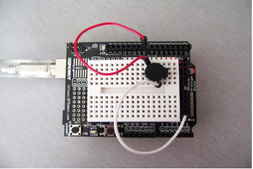

# Buzzer sound test
Arduino can be completed with a lot of interactive works, the most common and most commonly used is the sound and light show, in front of LED lights have been used in the experiment, the experiment let everyone's circuit sound, to make the sound The most common components are buzzers and speakers, the two are relatively simple and easy to use buzzer so we use the buzzer in this experiment.
The following are the components to be prepared:
1. Buzzer * 1
2. Button * 1
3. Breadboard * 1
4. Breadboard jumper * 1 bar

According to the following schematic connection circuit,


When connecting the circuit to note that the buzzer has positive and negative points, the following right side of the physical map can be seen buzzer red and black two wiring. Connect the circuit program This is very simple, and the front button control small lights is similar to the experimental program, because the buzzer control interface is the digital interface output high and low level can control the buzzer sound.
Reference source:
```c

int buzzer=8;// Set the digital IO pin to control the buzzer
void setup()
{
pinMode(buzzer,OUTPUT);// Set the digital IO mode, OUTPUT for the out
}
void loop()
{
unsigned char i,j;// Define the variable
while(1)
{
for(i=0;i<80;i++)// out of a frequency of sound
{
digitalWrite(buzzer,HIGH);// Make a sound
delay(1);// Delay 1ms
digitalWrite(buzzer,LOW);// No sound
delay(1);// Delay ms
}
for(i=0;i<100;i++)// The sound of another frequency
{
digitalWrite(buzzer,HIGH);// Make a sound
delay(2);// Delay 2ms
digitalWrite(buzzer,LOW);// No sound
delay(2);// Delay 2ms
}
}
}
```
Download the program, the buzzer experiment is complete.
