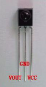
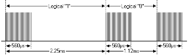
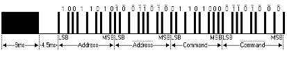
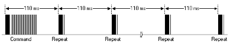
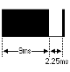

Example 19 Infrared remote control
1.Introduction to infrared receiver
What is an infrared receiver header?
Infrared remote control signal is a series of binary pulse code. In order to make it in the wireless transmission process from other infrared signal interference, usually first of its modulation in a specific carrier frequency, and then by the infrared emission diode to launch out, and the infrared receiver will filter out other clutter , Only to receive the specific frequency of the signal and restore it into a binary pulse code, that is, demodulation.
Second, the working principle
The built-in receiver tube converts the optical signal emitted from the infrared emission tube into a weak electrical signal. This signal is amplified by the IC internal amplifier, and then passed through the automatic gain control, band-pass filtering, demodulation, waveform shaping and reduced to the remote control Out of the original code, through the receiver of the signal output pin input to the electrical code on the identification circuit.
Third, the infrared receiver header and wiring



The infrared receiver has three pins as shown below:
VOUT connected to the analog port, GND connected to the test board on the GND, VCC received on the test board +5 v.
Infrared remote control experiment
Experimental device
- Infrared remote control: 1
- Infrared receiver: 1
- LED lights: 6
- 220ΩResistance: 6 pcs
- Colorful bread line: several

2.Experimental connection
First connect the board; then the infrared receiver in accordance with the above method is connected, the VOUT will be connected to the digital port 11, the LED lights through the resistor connected to the digital pins 2,3,4,5,6,7. Return to complete the circuit part of the connection.
3.Experimental principle
To decode a remote control, you must know how the remote control is encoded. The code of the controller used in this product is: NEC protocol. Here to introduce the NEC agreement:
NEC protocol description: Features: (1) 8-bit address, 8-bit command bit
（2）For the reliability of the address bits and the command bits are transmitted twice
（3）Pulse position modulation
（4) Carrier frequency 38khz
（5）Each bit is 1.125 ms for 2.25 ms
·Logic 0 and 1 are defined as shown below
The agreement is as follows：




Press the button to immediately release the release of the pulse:



The picture above shows a typical pulse sequence for NEC's protocol. Note: This first sends the LSB (least significant) protocol. The address of the above pulse transfer is 0x59 for 0x16. A message is started by a 9ms high level, followed by a low level of 4.5ms, (the two sections are composed of lead code) and then by the address code and the command code. Address and command transmission twice. The second all bits are negated and can be used to confirm the use of the received message. The total transfer time is constant because each point is repeated with its negated length. If you are not interested, you can ignore this reliability inversion, you can also expand the address and order to every 16 bits!
Press the button for a while to release the firing pulse:




A command is sent once, even if the button on the remote control is still pressed. When the key is pressed, the first 110ms pulse is the same as the previous figure, and then every 110ms of duplicate code is transmitted once. The repeat code is composed of a 9ms high pulse and a low level of 2.25ms and a high level of 560μs.
Repeat pulse



Note: After the pulse waveform into the integrated receiver, because the integrated receiver to be decoded, signal amplification and shaping, it should be noted that: no infrared signal, the output is high, there is a signal when the low Flat, so the output signal level and the opposite side of the launch. Receiver pulse can be seen through the oscilloscope, combined with the waveform to understand the program。

Remote key:
One row one = 0x00FFA25D; One row two = 0x00FFE01F; A row of three =0x00FF629D;
Two rows = 0x00FFA857; Two rows of two= 0x00FFE21D; Two rows of three = 0x00FF906F;
Three rows = 0x00FF22DD; Three rows of two = 0x00FF6897; Three rows of three = 0x00FF02FD;
Four rows= 0x00FF9867; Four rows two = 0x00FFC23D; Four rows of three = 0x00FFB047;


Code:

```c

#include <IRremote.h>
int RECV_PIN = 11;
int LED1 = 2;
int LED2 = 3;
int LED3 = 4;
int LED4 = 5;
int LED5 = 6;
int LED6 = 7;
long on1  = 0x00FFA25D;
long off1 = 0x00FFE01F;
long on2 = 0x00FF629D;
long off2 = 0x00FFA857;
long on3 = 0x00FFE21D;
long off3 = 0x00FF906F;
long on4 = 0x00FF22DD;
long off4 = 0x00FF6897;
long on5 = 0x00FF02FD;
long off5 = 0x00FF9867;
long on6 = 0x00FFC23D;
long off6 = 0x00FFB047;
IRrecv irrecv(RECV_PIN);
decode_results results;

// Dumps out the decode_results structure.
// Call this after IRrecv::decode()
// void * to work around compiler issue
//void dump(void *v) {
//  decode_results *results = (decode_results *)v

void dump(decode_results *results) {
  int count = results->rawlen;
  if (results->decode_type == UNKNOWN)
    {
     Serial.println("Could not decode message");
    }
  else
   {
    if (results->decode_type == NEC)
      {
       Serial.print("Decoded NEC: ");
      }
    else if (results->decode_type == SONY)
      {
       Serial.print("Decoded SONY: ");
      }
    else if (results->decode_type == RC5)
      {
       Serial.print("Decoded RC5: ");
      }
    else if (results->decode_type == RC6)
      {
       Serial.print("Decoded RC6: ");
      }
     Serial.print(results->value, HEX);
     Serial.print(" (");
     Serial.print(results->bits, DEC);
     Serial.println(" bits)");
   }
     Serial.print("Raw (");
     Serial.print(count, DEC);
     Serial.print("): ");

  for (int i = 0; i < count; i++)
     {
      if ((i % 2) == 1) {
      Serial.print(results->rawbuf[i]*USECPERTICK, DEC);
     }
    else
     {
      Serial.print(-(int)results->rawbuf[i]*USECPERTICK, DEC);
     }
    Serial.print(" ");
     }
      Serial.println("");
     }

void setup()
 {
  pinMode(RECV_PIN, INPUT);
  pinMode(LED1, OUTPUT);
  pinMode(LED2, OUTPUT);
  pinMode(LED3, OUTPUT);
  pinMode(LED4, OUTPUT);
  pinMode(LED5, OUTPUT);
  pinMode(LED6, OUTPUT);
  pinMode(13, OUTPUT);
  Serial.begin(9600);

  irrecv.enableIRIn(); // Start the receiver
 }

int on = 0;
unsigned long last = millis();

void loop()
{
  if (irrecv.decode(&results))
   {
    // If it's been at least 1/4 second since the last
    // IR received, toggle the relay
    if (millis() - last > 250)
      {
       on = !on;
       //      digitalWrite(8, on ? HIGH : LOW);
       digitalWrite(13, on ? HIGH : LOW);
       dump(&results);
      }
    if (results.value == on1 )
       digitalWrite(LED1, HIGH);
    if (results.value == off1 )
       digitalWrite(LED1, LOW);
    if (results.value == on2 )
       digitalWrite(LED2, HIGH);
    if (results.value == off2 )
       digitalWrite(LED2, LOW);
    if (results.value == on3 )
       digitalWrite(LED3, HIGH);
    if (results.value == off3 )
       digitalWrite(LED3, LOW);
    if (results.value == on4 )
       digitalWrite(LED4, HIGH);
    if (results.value == off4 )
       digitalWrite(LED4, LOW);
    if (results.value == on5 )
       digitalWrite(LED5, HIGH);
    if (results.value == off5 )
       digitalWrite(LED5, LOW);
    if (results.value == on6 )
       digitalWrite(LED6, HIGH);
    if (results.value == off6 )
       digitalWrite(LED6, LOW);
    last = millis();
    irrecv.resume(); // Receive the next value
  }
}

```

Fifth, the program function
The code pulse transmitted from the remote controller is decoded, and the corresponding action is executed according to the decoding result. Back to everyone you can use the remote control remote control of your device, let it listen to your command.
