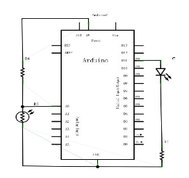
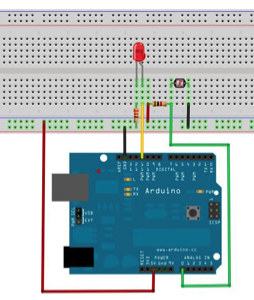

# Example 11 – Sensors


Photoresistor (photovaristor), also known as light sense resistor, is the use of semiconductor photoelectric effect made of a resistance value with the intensity of the incident light and change the resistance; incident light, the resistance decreases, the incident light weak, Increase. Photoresistors are generally used for light measurement, light control and photoelectric conversion (converting light changes to electrical changes).
Photoresistor can be widely used in a variety of light control circuit, such as lighting control, regulation and other occasions, can also be used for light control switch.
This experiment we first carry out a relatively simple use of photosensitive resistors. Since the photosensitive resistor can be changed according to the light intensity of the components, naturally also need to read the analog value of the analog port, and this experiment can learn from the PWM interface experiment, the potentiometer for photoresistor to achieve when the light intensity is different LED small lights Brightness will be a corresponding change.
The following are the required components:

1. Photoresistor * 1
2. Red M5 Straight LED * 1
3. 10KΩ Straight-through Resistor * 1
4. 220Ω Straight-through Resistor * 1
5. Breadboard * 1
6. Breadboard jumper * 1 bar

Connect the circuit according to the following schematic.






Can be prepared to connect the program, the experimental program and the PWM experimental program is similar to the PWM value assignment only in accordance with our current circuit slightly modified (see part of the modified source).

Reference source:


```c

int potpin=0;// Define analog interface 0 Connect the photoresistor
int ledpin=11;// Define the digital interface 11 to output the PWM to adjust the LED brightness
int val=0;// Define the variable val
void setup()
{
pinMode(ledpin,OUTPUT);// Define the digital interface 11 for the output
Serial.begin(9600);// Set the baud rate to 9600
}
void loop()
{
val=analogRead(potpin);// Read the analog value of the sensor and assign it to val
Serial.println(val);// Display val variable values
analogWrite(ledpin,val);// Turn on the LED and set the brightness (PWM output maximum 255)
delay(10);// Delay 0.01 seconds
}

```

Here we divide the sensor return value by 4 because the return value of the analog input analogRead () function is 0 to 1023, and the output value of the analog output analogWrite () function ranges from 0 to 255. Download the program and then try to change the light resistance of the environment where the light intensity can see our small lights have a corresponding change. In daily life, the application of photoresistor is very extensive, usage is also a lot, we can root
According to this experiment learn by analogy, to make better interactive works.
